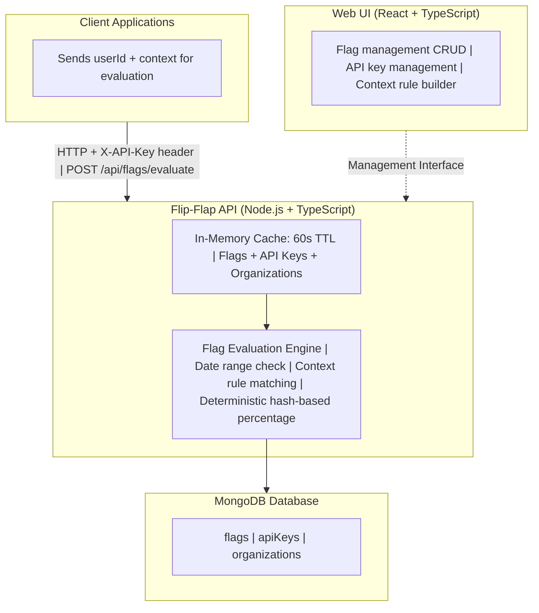

# Flip-Flap

A lightweight feature flag management system for progressive rollout and context-based targeting.

## What is Flip-Flap?

Flip-flap enables you to:
- **Progressive Rollout**: Gradually enable features using percentage-based rollout with date ranges
- **Context-Based Targeting**: Enable features based on user attributes (location, account age, custom fields)
- **Multi-Environment**: Manage different configurations for development, staging, and production
- **Deterministic**: Same user always gets same result for consistent experience

## Architecture



## Quick Start

### Prerequisites

- Node.js 22.5.1
- Docker & Docker Compose
- npm

### Setup

```bash
# Start MongoDB
docker-compose up -d

# Install and start API
cd api
npm install --save-exact
cp .env.example .env
npm run dev

# Install and start Web UI
cd ../web
npm install --save-exact
cp .env.example .env
npm run dev
```

- API: http://localhost:3000
- Web UI: http://localhost:5173

### Basic Usage

```javascript
// Evaluate a flag
const response = await fetch('http://localhost:3000/api/flags/evaluate', {
  method: 'POST',
  headers: {
    'X-API-Key': 'your-api-key',
    'Content-Type': 'application/json'
  },
  body: JSON.stringify({
    flagKey: 'premium-dashboard',
    context: {
      userId: 'user_12345',
      location: 'US',
      accountAge: 45
    }
  })
});

const result = await response.json();
if (result.enabled) {
  // Show feature
}
```

## Tech Stack

- **Backend**: Node.js, Express/Fastify, MongoDB, TypeScript
- **Frontend**: React, TypeScript, TailwindCSS/MUI
- **Cache**: In-memory (POC), Redis (future)
- **Validation**: Zod

## Documentation

- **[Specifications](specifications.md)**: Complete API contracts, data models, and evaluation algorithm
- **[Implementation Guide](implementation.md)**: Architecture decisions, development setup, and deployment

## Key Design Principles

1. **Stateless API**: No user state stored server-side
2. **Environment Inference**: API keys determine environment
3. **Fail-Safe**: Missing context or invalid data always returns `enabled: false`
4. **Deterministic Rollout**: Hash-based percentage for consistent user experience
5. **Multi-tenancy**: Organization-scoped flags and API keys

## Out of Scope (v1 POC)

- A/B testing variants
- Usage analytics
- Language-specific SDKs
- SSO/OAuth
- Webhooks
- Real-time updates
